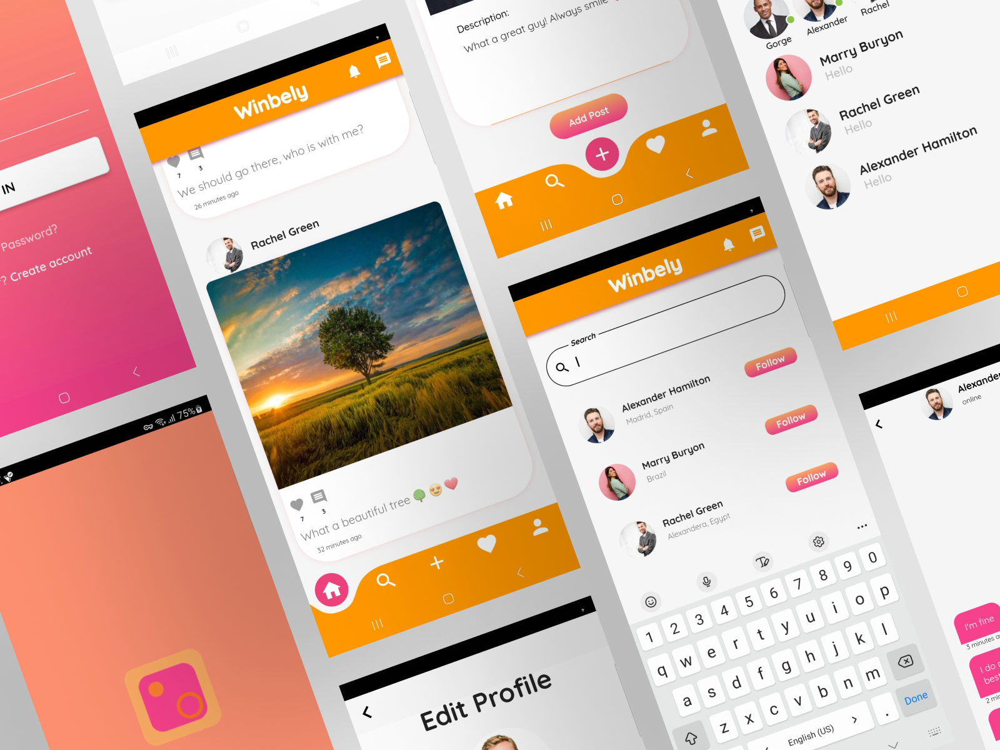
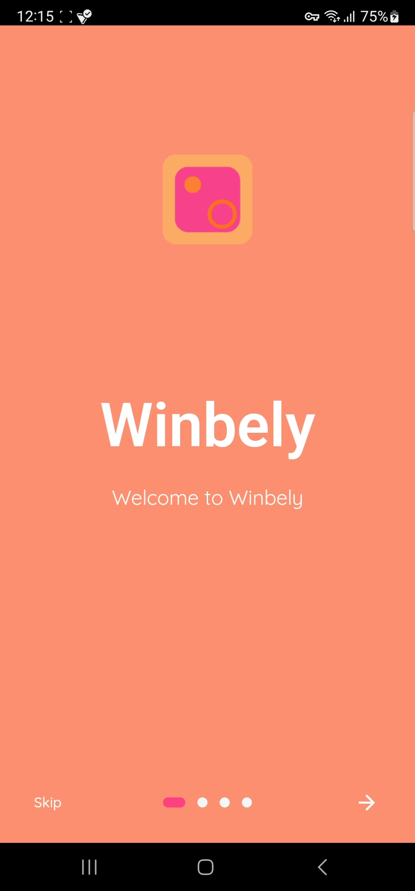
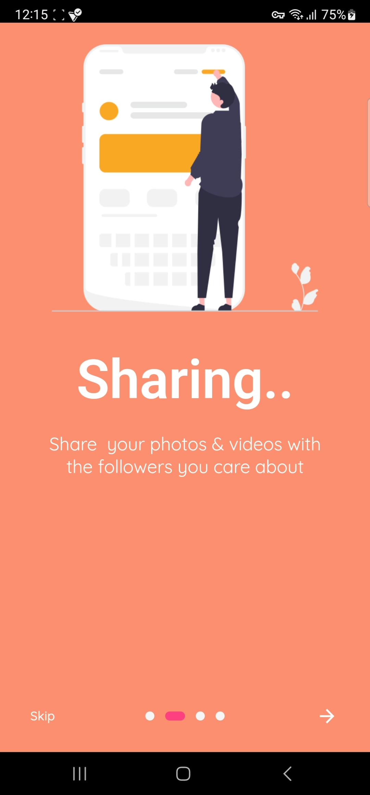
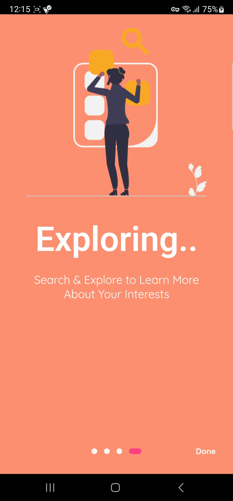
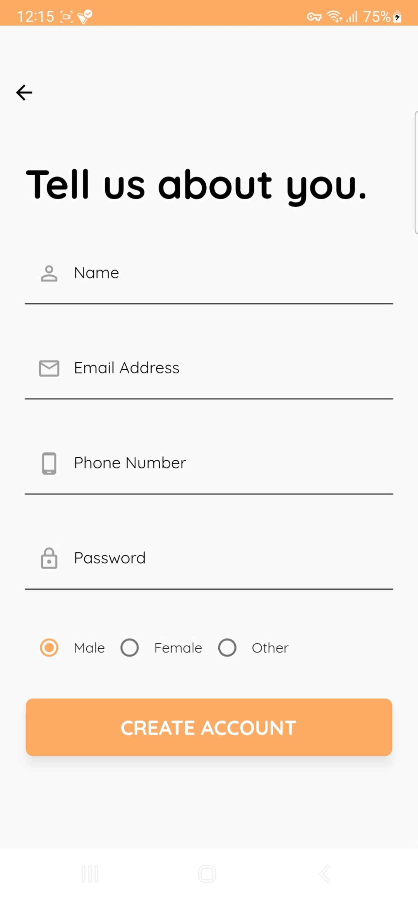
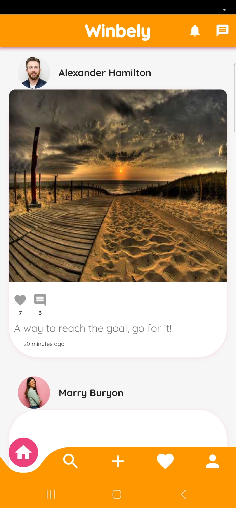
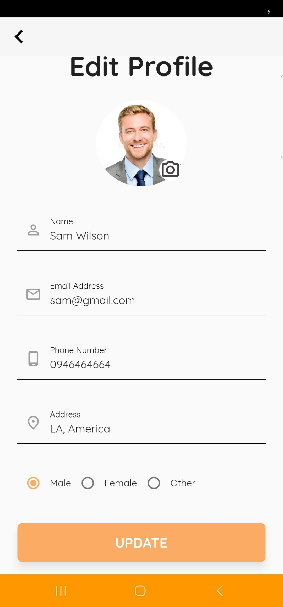
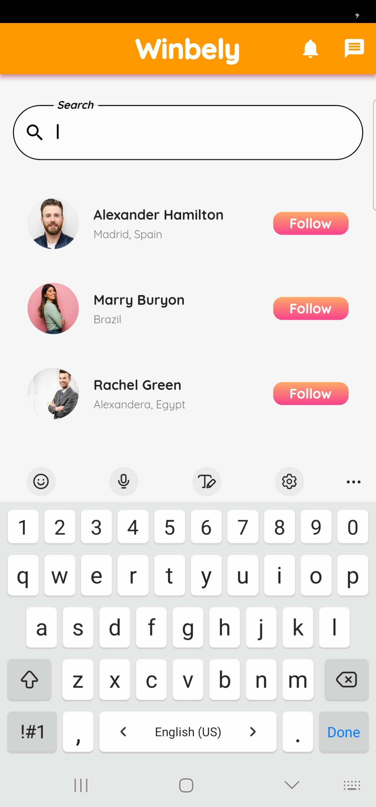
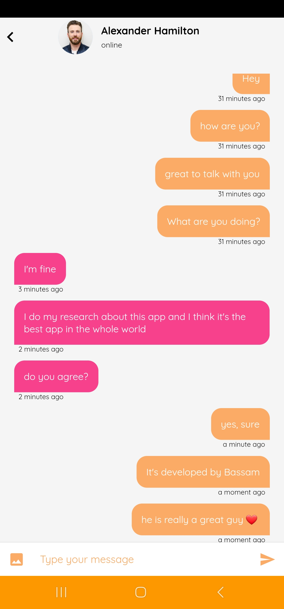
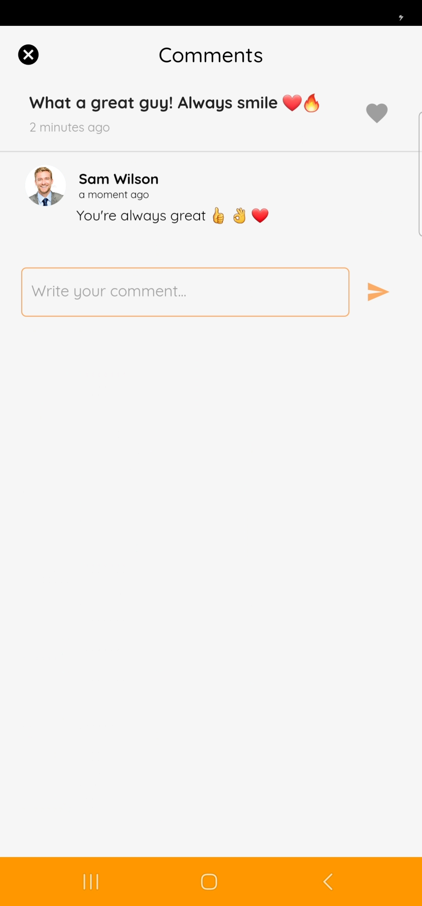

# 🔥🔥 Winbely Social Media App 

A Social media app created with Flutter and Firebase.(inspired from instagram).

## Getting Started

Winbely is a fully functional social media app with multiple features built with flutter and dart.

Star ⭐ the repo to support the project.

## Features

- Login and register as a user in this app.

- Reset password by your email.

- Observing all posts that everyone posts.

- Posing pictures and videos with description.

- Seaching about people and to follow and unfollow them.

- Like posts and add them to favorites page.

- Adding comments to any post.

- Profile Screen to see user information (followes - following - posts).

- Editing user information.

- One to One Chat with any user (Realtime Messaging).

## Screenshots

  
   
  

  
   
  

  
   
  

  
   
  

  
   
  

